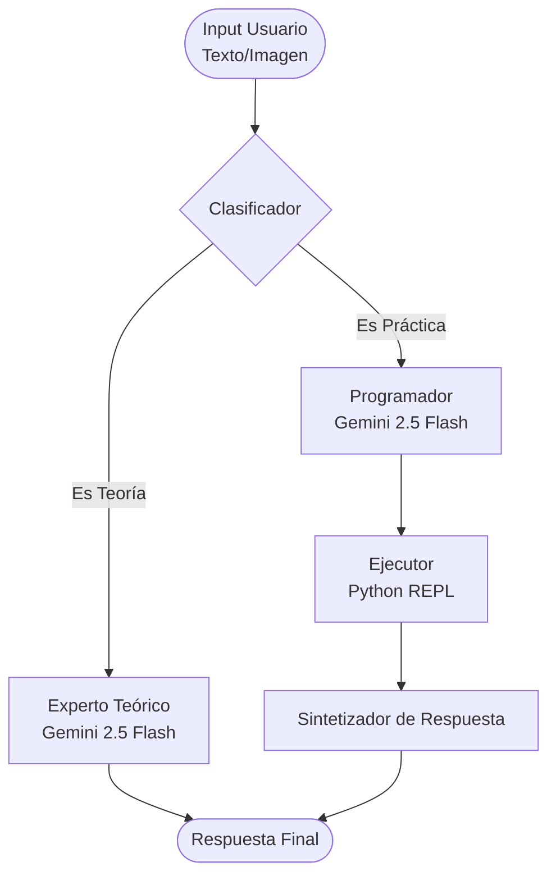

# 🎓 Python Tutor Agentic System


[](https://colab.research.google.com/drive/1TcCsKJDziIyC4P_VX6-SJJs2kgKb-vy6?usp=sharing)

Un sistema agéntico inteligente diseñado para actuar como tutor universitario de programación en Python. Utiliza una arquitectura de grafos para clasificar, razonar, generar código y validarlo mediante ejecución real.

## 🏆 Certificación Obtenida

Este proyecto fue desarrollado e implementado exitosamente como parte de los requisitos para obtener la certificación profesional, dictada por la W&B AI Academy (https://wandb.ai/site):

**🎓 AI Engineering: Agents**

[📜 Ver Credencial / Certificado](https://api.accredible.com/v1/auth/invite?code=9aa6bec2d643249425b6&credential_id=723f11e8-d673-4d9a-b5b1-62a8f1324935&url=https%3A%2F%2Fwww.credential.net%2F723f11e8-d673-4d9a-b5b1-62a8f1324935&ident=436e38da-31a6-4e24-992a-cd1e106f3e3c)

## 🌟 Características Principales

* **🧠 Arquitectura Agéntica:** Implementado sobre **LangGraph** para un flujo de control determinista y robusto.
* **👀 Multimodalidad Nativa:** Capaz de recibir **Imágenes** (capturas de ejercicios, errores) y **Texto** simultáneamente.
* **🛡️ Ejecución Segura (Sandbox):** Incluye un nodo `PythonREPL` que ejecuta el código generado por la IA para verificar su correctitud antes de entregarlo al usuario.
* **📊 Observabilidad Completa:** Integración con **Weave (W&B)** para trazas detalladas de latencia, inputs y outputs.
* **🎯 Enrutamiento Estricto:** Utiliza **Pydantic** para clasificar consultas estrictamente dentro del programa de estudio oficial.

## 🏗️ Arquitectura Lógica

El sistema funciona como una máquina de estados finitos. A continuación se detalla el flujo de decisión:


## 🛠️ Stack Tecnológico
* LLM: Google Gemini 2.5 Flash (Optimizado para velocidad y código).

* Framework: LangChain & LangGraph.

* Validación: Pydantic.

* Tracing: Weights & Biases (Weave).

* Entorno: Google Colab / Jupyter Notebook.

## 📋 Casos de Uso Demostrados
1.Resolución de Ejercicios Visuales: El agente extrae datos de una imagen PNG y genera el script para resolverlo.

2.Consultas Conceptuales: Explicaciones pedagógicas sobre estructuras de datos.

3.Debugging Automático: Generación y prueba de scripts en tiempo real.

## 🚀 Cómo Ejecutar
1.Clonar el repositorio.

2.Instalar dependencias:

```bash
pip install google-genai langchain langchain-google-genai langgraph langchain-experimental pydantic weave
```
3.Configurar API Keys (Google AI Studio & W&B).

4.Ejecutar el notebook Agente_Tutor_Universitario.ipynb.
[](https://colab.research.google.com/drive/1TcCsKJDziIyC4P_VX6-SJJs2kgKb-vy6?usp=sharing)

## 📈 Trazabilidad (Weave)
Este proyecto implementa monitoreo de trazas para auditoría de IA. Ver Dashboard de Ejemplo en W&B (https://wandb.ai/teamlg-ai/agente_tutor_python/weave/traces?view=traces_2025-12-12_05-41-48-915)

### Author:

Leandro Guiñazu. Proyecto desarrollado como parte del portfolio de Ingeniería de IA Generativa.

